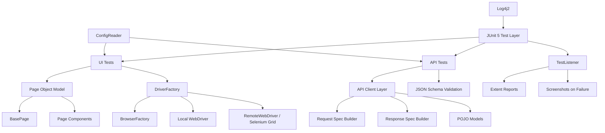

# E-Commerce Test Automation Framework

A Java-based hybrid test automation framework for validating an e-commerce application through both UI and API tests. The framework demonstrates practical SDET/QA automation engineering skills: Selenium WebDriver, REST Assured, JUnit 5, Maven, Docker Selenium Grid, CI/CD pipelines, structured reporting, logging, configuration management, and reusable test architecture.

This repository is designed as a portfolio-ready automation framework that a recruiter, hiring manager, or technical interviewer can inspect without needing a traditional frontend application.


Key proof points:

- UI automation for SauceDemo e-commerce workflows
- API automation for DemoQA BookStore endpoints
- Page Object Model for maintainable browser tests
- REST Assured API client layer with schema validation
- JUnit 5 tags and parallel execution
- ThreadLocal WebDriver lifecycle for parallel browser safety
- Docker Selenium Grid for remote browser execution
- GitHub Actions workflow for CI execution
- Jenkins declarative pipeline for enterprise CI/CD demonstration
- Extent HTML reports with logs and test status

A sample generated report is created at:

```text
test-output/reports/ExtentReport.html
```

Generated reports are intentionally not committed to GitHub. For recruiter presentation, add selected screenshots under `docs/screenshots/`.

## Project Summary

The framework validates two application surfaces:

| Area | Target | Tooling |
|---|---|---|
| UI tests | SauceDemo e-commerce app | Selenium WebDriver, JUnit 5 |
| API tests | DemoQA BookStore API | REST Assured, AssertJ, JSON schema validation |
| Reports | Local generated HTML report | Extent Reports |
| CI/CD | Automated build and test execution | GitHub Actions, Jenkins |
| Grid execution | Remote browser runs | Docker Selenium Grid |

## Tech Stack

| Technology | Purpose |
|---|---|
| Java 21 | Main programming language |
| Maven | Build and dependency management |
| Selenium WebDriver | Browser automation |
| JUnit 5 | Test runner, tags, lifecycle hooks, parallel execution |
| REST Assured | API test automation |
| AssertJ | Fluent assertions |
| Jackson | JSON serialization/deserialization |
| JSON Schema Validator | API response contract validation |
| WebDriverManager | Local browser driver management |
| Extent Reports | HTML test execution reports |
| Log4j2 | Application and framework logging |
| Docker Compose | Selenium Grid orchestration |
| GitHub Actions | Cloud CI workflow |
| Jenkins | Declarative CI/CD pipeline |

## Architecture



## Folder Structure

```text
ecommerce-automation-framework/
|
|-- .github/workflows/
|   `-- regression.yml                  # GitHub Actions pipeline
|
|-- docker/
|   |-- Dockerfile                      # Test runner container
|   `-- docker-compose.yml              # Selenium Grid services
|
|-- src/main/java/com/ecommerce/framework/
|   |-- api/                            # API clients, models, request/response specs
|   |-- config/                         # ConfigReader and framework constants
|   |-- drivers/                        # BrowserFactory and DriverFactory
|   |-- exceptions/                     # Custom framework exceptions
|   |-- listeners/                      # JUnit extensions, retry/report hooks
|   |-- pages/                          # Page Object Model classes
|   |-- reports/                        # Extent report managers
|   `-- utils/                          # Wait, screenshot, JSON, Excel, date utilities
|
|-- src/main/resources/
|   |-- config/                         # qa, uat, prod environment properties
|   |-- schemas/                        # API JSON schema files
|   |-- testdata/                       # Test data files
|   `-- log4j2.xml                      # Logging configuration
|
|-- src/test/java/com/ecommerce/tests/
|   |-- api/                            # REST API tests
|   |-- base/                           # BaseTest for UI tests
|   `-- ui/                             # Login, inventory, cart, checkout tests
|
|-- Jenkinsfile                         # Jenkins declarative pipeline
|-- pom.xml                             # Maven project config
|-- README.md
`-- CONTRIBUTING.md
```

## Test Coverage

### UI Test Coverage

The UI suite validates common e-commerce flows on SauceDemo:

- Login with valid and invalid users
- Inventory page loading and product interactions
- Add to cart behavior
- Cart page validation
- Checkout journey from login to order confirmation
- Negative checkout validation
- Cross-browser execution scenarios

Main UI test classes:

```text
src/test/java/com/ecommerce/tests/ui/LoginTest.java
src/test/java/com/ecommerce/tests/ui/InventoryTest.java
src/test/java/com/ecommerce/tests/ui/CartTest.java
src/test/java/com/ecommerce/tests/ui/CheckoutTest.java
src/test/java/com/ecommerce/tests/ui/CrossBrowserTest.java
```

### API Test Coverage

The API suite validates DemoQA BookStore endpoints:

- `GET /BookStore/v1/Books` returns HTTP 200 and a non-empty book list
- Books response matches JSON schema
- Valid ISBN returns expected book data
- Invalid ISBN returns a client error
- API response time is under the configured threshold
- Required fields such as ISBN, title, and author are present
- Response content type is JSON

Main API test class:

```text
src/test/java/com/ecommerce/tests/api/BookStoreApiTest.java
```

## Design Patterns And Engineering Practices

| Practice | Where It Appears | Why It Matters |
|---|---|---|
| Page Object Model | `pages/` package | Keeps UI locators and actions separate from assertions |
| Component Object | `HeaderComponent` | Reuses common page fragments |
| Factory Pattern | `BrowserFactory` | Centralizes browser creation |
| ThreadLocal | `DriverFactory` | Prevents WebDriver sharing across parallel test threads |
| Singleton | `ConfigReader`, report manager | Provides controlled shared framework services |
| Builder Pattern | API request/response spec builders | Reuses REST Assured setup cleanly |
| Custom Exceptions | `exceptions/` package | Makes framework failures easier to diagnose |
| Listener/Extension | `TestListener` | Hooks reporting into the JUnit lifecycle |
| Environment Config | `qa.properties`, `uat.properties`, `prod.properties` | Supports environment-specific execution |

## Prerequisites

Install these before running locally:

| Tool | Recommended Version |
|---|---|
| Java JDK | 21 or newer |
| Maven | 3.9 or newer |
| Chrome | Latest stable version |
| Firefox / Edge | Optional, for cross-browser runs |
| Docker Desktop | Optional, required for Selenium Grid runs |
| Git | Latest stable version |

Verify local tools:

```bash
java -version
mvn -version
docker --version
```

## Configuration

Environment files live here:

```text
src/main/resources/config/qa.properties
src/main/resources/config/uat.properties
src/main/resources/config/prod.properties
```

Common runtime options:

| Option | Example | Description |
|---|---|---|
| `-Denv` | `-Denv=qa` | Selects environment config file |
| `-Dbrowser` | `-Dbrowser=chrome` | Selects browser: chrome, firefox, edge |
| `-Dheadless` | `-Dheadless=true` | Runs browser without visible UI |
| `-Dexecution` | `-Dexecution=local` | Selects local or remote execution |
| `-DgridUrl` | `-DgridUrl=http://localhost:4444` | Selenium Grid URL |
| `-Dgroups` | `-Dgroups=smoke` | Runs selected JUnit tag group |

Supported tags:

| Tag | Purpose |
|---|---|
| `smoke` | Fast confidence checks |
| `regression` | Broader regression coverage |
| `api` | API-only tests |
| `ui` | Browser-based tests |
| `e2e` | End-to-end user journeys |
| `negative` | Error and validation scenarios |
| `crossbrowser` | Browser compatibility scenarios |

## How To Run Tests Locally

### Run API Tests

API tests do not require a browser and are the fastest way to verify the framework.

```bash
mvn clean test -Denv=qa -Dgroups=api
```

Expected result:

```text
Tests run: 7, Failures: 0, Errors: 0, Skipped: 0
BUILD SUCCESS
```

### Run UI Smoke Tests On Chrome

```bash
mvn clean test -Denv=qa -Dbrowser=chrome -Dgroups=smoke
```

### Run UI Tests In Headless Mode

```bash
mvn clean test -Denv=qa -Dbrowser=chrome -Dheadless=true -Dgroups=ui
```

### Run Regression Tests

```bash
mvn clean test -Denv=qa -Dbrowser=chrome -Dgroups=regression
```

### Run Cross-Browser Tests

```bash
mvn clean test -Denv=qa -Dgroups=crossbrowser
```

## Selenium Grid With Docker

Start the Selenium Grid:

```bash
docker-compose -f docker/docker-compose.yml up -d selenium-hub chrome-node firefox-node edge-node
```

Open the Grid UI:

```text
http://localhost:4444/ui
```

Run tests against the Grid:

```bash
mvn clean test \
  -Denv=qa \
  -Dbrowser=chrome \
  -Dheadless=true \
  -Dexecution=remote \
  -DgridUrl=http://localhost:4444 \
  -Dgroups=smoke
```

Stop the Grid:

```bash
docker-compose -f docker/docker-compose.yml down
```

## Test Reports

After a test run, the framework creates an Extent HTML report:

```text
test-output/reports/ExtentReport.html
```

The report includes:

- test names
- pass/fail status
- timestamps
- environment metadata
- browser and execution mode
- logs from test lifecycle events
- screenshots for configured failure scenarios

Generated reports are ignored by Git because they are local execution artifacts. For portfolio presentation, add selected screenshots under:

```text
docs/screenshots/
```

Recommended screenshots for recruiters:

- Extent report dashboard
- Successful GitHub Actions run
- Selenium Grid UI
- Project folder structure

## Logging

Logs are written using Log4j2. The main log output is generated under:

```text
logs/framework.log
```

Logs are ignored by Git because they are generated during execution.

## CI/CD

### GitHub Actions

Workflow file:

```text
.github/workflows/regression.yml
```

The workflow demonstrates:

- build and compile checks
- API test execution
- UI smoke tests with Selenium Grid service containers
- scheduled regression runs
- manual workflow dispatch with environment/browser inputs
- report artifact upload
- GitHub job summary output

### Jenkins

Pipeline file:

```text
Jenkinsfile
```

The Jenkins pipeline demonstrates:

- parameterized environment/browser/tag selection
- Maven compile stage
- API test stage
- Selenium Grid startup through Docker Compose
- UI test execution
- Extent report publishing
- artifact archiving for reports and logs
- Grid cleanup after pipeline completion

## Key Files To Review

Good entry points for code review:

| File | Why It Matters |
|---|---|
| `src/main/java/com/ecommerce/framework/drivers/DriverFactory.java` | Thread-safe WebDriver lifecycle |
| `src/main/java/com/ecommerce/framework/drivers/BrowserFactory.java` | Browser-specific local driver and capabilities setup |
| `src/main/java/com/ecommerce/framework/pages/BasePage.java` | Common UI interaction primitives |
| `src/main/java/com/ecommerce/framework/pages/LoginPage.java` | Page Object Model example |
| `src/main/java/com/ecommerce/framework/api/clients/BookStoreApiClient.java` | API client abstraction |
| `src/test/java/com/ecommerce/tests/api/BookStoreApiTest.java` | API validation examples |
| `src/test/java/com/ecommerce/tests/ui/CheckoutTest.java` | End-to-end UI flow example |
| `src/main/java/com/ecommerce/framework/listeners/TestListener.java` | JUnit lifecycle reporting integration |
| `src/main/java/com/ecommerce/framework/reports/ExtentReportManager.java` | HTML report configuration |
| `.github/workflows/regression.yml` | GitHub Actions CI setup |
| `Jenkinsfile` | Jenkins CI/CD setup |
| `docker/docker-compose.yml` | Selenium Grid setup |

## GitHub Upload Guidance

Commit source and configuration files:

```text
.github/workflows/
docker/
src/
.gitignore

Jenkinsfile
pom.xml
README.md
```


## Current Verification

The API test suite was verified locally with:

```bash
mvn test -Dgroups=api -DskipTests=false
```

Result:

```text
Tests run: 7, Failures: 0, Errors: 0, Skipped: 0
BUILD SUCCESS
```

